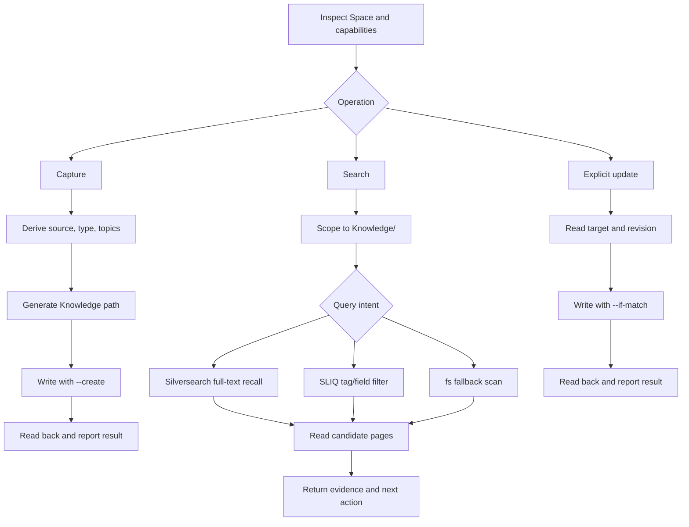

# Agent-native SilverBullet knowledge workflow

Status: proposed. This document defines the day-one contract for the `silverbullet-kb` skill before implementation.

## Intent

The consumer of this system is an agent. The skill must teach the agent when to load the workflow, how to operate the real SilverBullet interfaces, how to interpret their feedback, and what action to take next. A user-facing sentence such as "nothing found" is not a sufficient result; the agent needs to know whether the query was empty, the index was unavailable, or the call failed.

The user is the value gate. A document enters the formal KB only when the user explicitly invokes the capture operation. Capture writes immediately after validation. The skill does not score value automatically and does not create an inbox promotion workflow in day one.

## Scope and non-goals

The skill covers four operations: inspect the target Space, capture a new document, search the KB, and update an explicitly identified page. It owns the agent protocol, tag derivation, path generation, command selection, result interpretation, read-back verification, and recovery rules.

The skill does not deploy SilverBullet, install or configure search plugs, maintain a separate tag registry, decide whether a user-selected document is valuable, rewrite upstream lecture or research content, or search the whole Space by default.

## SilverBullet model

SilverBullet exposes a Space whose source of truth is a directory of Markdown pages and other files. The Space also contains system content such as `Library/` pages, templates, configuration definitions, and plug bundles. Pages, tags, links, and paragraphs are derived indexes available through the Runtime API. `sb fs` operates on files; `sb query` and `sb eval` operate through Runtime; full-text search is provided by an optional plug such as Silversearch.

The current `bohrium-hindsight` Space confirms this shape: it contains `index.md`, `Library/Std`, `Library/mrmugame/silversearch.plug.js`, `Repositories/Std.md`, and `notes/day-one.md`, with no `Knowledge/` directory yet. The skill must create or use `Knowledge/` as a dedicated top-level scope for formal knowledge documents.

## Knowledge document contract

All captured documents are written under `Knowledge/` in a flat layout. The directory is a retrieval boundary, not a taxonomy; the agent uses tags and content for classification.

The first H1 in the upstream document is the display title and is preserved. The skill generates the storage path from a readable title slug plus a short collision suffix, for example `Knowledge/并发写入冲突--a7f3.md`. The path is a file address, not the title. Updating the H1 never renames the path. The skill does not add aliases by default.

The frontmatter `tags` array contains exactly one `source/<project>`, exactly one `type/<kind>`, and one to three `topic/<slug>` values. `source` is resolved from the Git remote repository name, then the Git root directory name, then `unknown`; skill names are never used as source values. The initial type values are `experience` for a lived engineering process and `research` for systematic investigation or source analysis. The type set is open: a user-explicit new type is accepted, while an agent-inferred new type is proposed for confirmation. Topic values are lowercase kebab-case, focus on core themes, and reuse existing values when possible.

Capture always creates a new page with `sb fs write PATH --create`; it never searches for a similar page and silently updates it. Update is a separate explicit operation and requires a path, page link, or unique title. It reads the current revision and writes with `--if-match`; a conflict stops the operation and causes a fresh read rather than an overwrite.

## Agent workflow

### Inspect

Select the configured Space without printing credentials. Confirm whether `Knowledge/` exists with `sb fs ls`; discover the live page and tag schemas with `sb describe` when Runtime is available; inspect the current tag inventory through the live index rather than a hand-maintained registry. Check index availability before treating an empty structured query as evidence that no page exists.

### Capture

Capture begins only after an explicit user invocation. Read the upstream artifact and its first H1, resolve the project source, assign one type by primary evidence, derive one to three core topics, reuse known tag spellings, generate a flat path, and write with `--create`. Read the new page back and return a machine-readable result containing `status`, `path`, `title`, `tags`, `revision`, `verified`, and `next`.

### Search

First restrict the search to `Knowledge/`. Classify the request as a lexical recall, a strict tag/field filter, or a mixed query. Use Silversearch for lexical recall when the plug is available; use SLIQ over `index.pages()` for strict tag and metadata conditions; use bounded `fs ls` plus reads as a fallback when Runtime or Silversearch is unavailable. A mixed query uses SLIQ to narrow candidates and then reads candidate pages or uses Silversearch with `singleFilePath` for content confirmation.

Extract a small set of concrete search terms from the question: the main entity, the event or mechanism, and a distinctive phrase or project name. Use quoted phrases for exact wording and expand once with known aliases or a close synonym when recall is empty. Do not turn the temporary query terms into permanent tags.

Read candidate pages before using them as evidence. Return `path`, display title, tags, updated time, excerpt or evidence anchor, and the reason the page matched. The search result is for the calling agent; the agent decides how to present the evidence to its own user.

### Update

An update starts only from an explicit target. Resolve a unique title to a path only when the result is unambiguous; otherwise stop with candidate paths. Read the latest bytes and revision, apply the requested change while preserving unrelated content, write with `--if-match`, and read back the final page.

## Feedback interpretation contract

Every command result must be normalized internally into a status and next action. The skill must distinguish these cases:

| Feedback | Meaning | Agent action |
|---|---|---|
| Silversearch result array with `name`, `score`, `matches`, or `excerpts` | Full-text candidates | Read the top candidates and verify evidence |
| Successful query with an empty table such as `{}` or count `0` | No match for this query and scope | Relax one self-chosen term/filter or switch engine once |
| `sb query`/Runtime reports index unavailable or incomplete | Structured result is not authoritative | Check availability, wait/retry once if appropriate, then use file fallback or report capability gap |
| Non-zero command exit for invalid arguments or connection/runtime failure | Operation failed | Correct the command or connection; never report this as knowledge absence |
| `fs ls` exit 7 with a limit | Listing was truncated | Continue pagination or remove the limit before concluding |
| `fs write --create` conflict | Target already exists | Generate a new capture path; do not overwrite |
| `fs write --if-match` conflict | Target changed since read | Re-read and ask or reapply the explicit update; never blind retry |

Observed day-one feedback supports this contract: `sb describe page` returns a live schema; a `Knowledge/` SLIQ query currently returns `{}` with exit 0 because that directory is empty; Silversearch returns a result object for the smoke note and an empty result for a nonexistent marker, both with exit 0. The two empty cases are valid query results, not service errors.

## Retrieval quality loop

The skill uses a bounded loop: inspect capabilities, run the narrowest appropriate query, interpret the result, read candidates, and only then perform one controlled relaxation. A relaxation may remove a strict topic filter, replace an exact phrase with a distinctive term, or add a known alias. It may not silently expand from `Knowledge/` to system content. If the second attempt still has no evidence, return a structured no-evidence result to the calling agent.

## References and implementation notes

The implementation should keep `SKILL.md` short enough to be loaded with the calling prompt. Put command details and result shapes in focused references such as `references/sb-cli.md`, `references/search.md`, and `references/document-contract.md`. The references must link to the official SilverBullet CLI, Runtime API, Integrated Query, Frontmatter, and Full Text Search documentation.

The first eval set must test the complete agent loop rather than prose recall: capture into `Knowledge/`, search by a phrase without tags, strict type/topic filtering, system-content exclusion, empty-result interpretation, missing-plugin fallback, explicit update with revision conflict, dynamic type addition, source fallback to `unknown`, topic reuse, and read-back verification. Run a no-skill baseline before writing the skill, then repeat the same scenarios after the skill is present and record any new rationalizations.

## Acceptance criteria

Day one is complete when an agent can load the skill from its description, inspect the target Space, capture a user-selected experience or research document, find it by full-text terms, filter it by source/type/topic, explain an empty result correctly, update it only when explicitly directed, and recover from a stale revision without guessing. The skill is not complete when it merely lists SilverBullet commands or tells a user that a search returned no result.
